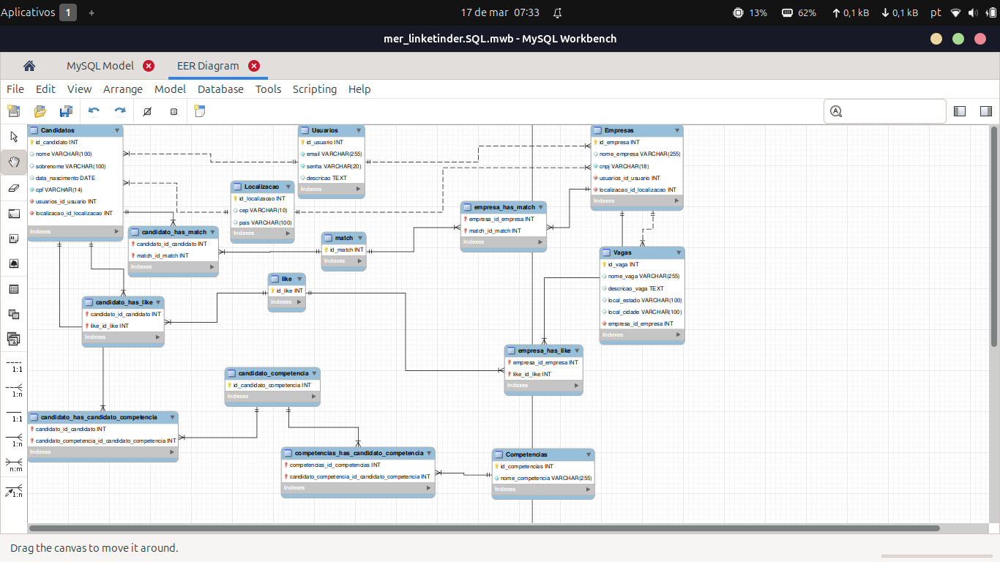

# Linketinder

O **Linketinder** é uma aplicação que simula um sistema de cadastro e busca para candidatos e empresas. A ideia é fazer com que candidatos e empresas possam se cadastrar no sistema e visualizar os outros registros cadastrados.

## Funcionalidades

- **Cadastro de Candidatos**: Permite que os candidatos insiram seus dados pessoais, competências e experiência profissional.
- **Cadastro de Empresas**: Permite que as empresas se cadastrem com informações como nome, CNPJ, competências desejadas e descrição da empresa.
- **Listar Candidatos**: Exibe todos os candidatos cadastrados no sistema.
- **Listar Empresas**: Exibe todas as empresas cadastradas no sistema.
- **Opções de navegação**: Um menu de navegação onde o usuário pode escolher as ações que deseja realizar.
- **Interface Web**: Agora o projeto conta com uma interface interativa, com gráficos, telas de cadastro e de acesso ao perfil.
- **Validação de dados**: Atualmente, o projeto conta com uma validação de dados feita por regex!
- **Integração com banco de dados**: O projeto agora conta com um banco de dados integrado ao backend!

## Como Usar

### Instruções:

1. Clone o repositório ou baixe o projeto.
2. Compile e execute o código no seu IDE ou via terminal. (Versão backend)
   2.1. O menu principal será exibido. Selecione uma opção:
   - **1** para cadastrar um candidato.
   - **2** para cadastrar uma empresa.
   - **3** para listar candidatos cadastrados.
   - **4** para listar empresas cadastradas.
   - **5** para sair da aplicação.
3. Use o vite para rodar o servidor localmente. (Versão frontend)
   3.1.: Uma tela de menu será exibida. Você pode escolher entre cadastrar uma empresa, cadastrar um candidato, olhar os perfis de candidatos disponíveis e olhar as vagas disponíveis. Ao olhar os candidatos disponíveis, um gráfico é apresentado, representando as competências escolhidas pelos candidatos.

## Contribuição

Se você deseja contribuir para o desenvolvimento deste projeto, siga os passos abaixo:

1. Fork este repositório.
2. Crie uma branch para suas alterações (`git checkout -b feature/nova-feature`).
3. Commit suas alterações (`git commit -am 'Adiciona nova feature'`).
4. Push para a branch (`git push origin feature/nova-feature`).
5. Abra um pull request.

### MySQL

Na feature mais recente, comecei a trabalhar com banco de dados. Ainda não foi integrado completamente, mas será em features futuras.

### MySQL Workbench

Aqui uma demonstração de como me planejei e organizei o MySQL

### Autora

Gio PCosta
